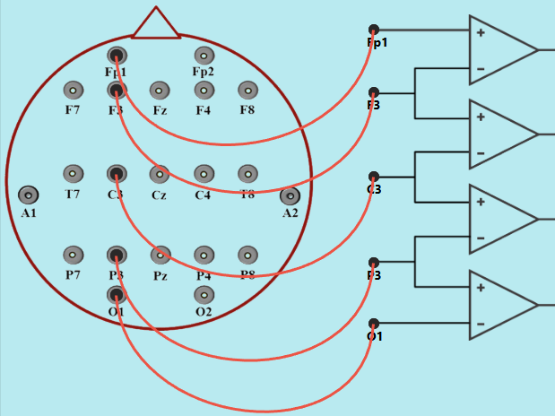
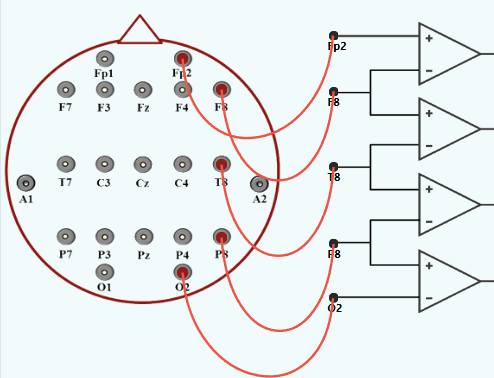

<h3> Procedure for Unipolar (Referential) Montage</h3>

<h4> 1. For Prefrontal Lobe (Fp1, Fp2)</h4>

<b>Step 1:</b>
Click on the <b>EEG cap</b> to start making connections. 

<b>Step 2: Establish connections</b> 

1. Connect Fp1 lead point of human brain to the positive terminal (Fp1) of op-amp circuit. 
2. Connect Fp2 lead point of human brain to the positive terminal (Fp2) of op-amp circuit. 
3. Connect Ground lead point A1 of human brain to the negative terminal (A1) of op-amp circuit. 
4. Connect Ground lead point A2 of human brain to the negative terminal (A2) of op-amp circuit. 

<b>Step 3:</b>
Refer to the accompanying figure for correct connection points. 

 

<b>Step 4:</b>
Select an <b>EEG Signal Mode</b> from the dropdown menu: 
- Normal 
- Eye Blink 
- Jaw Clenching 
- Forearm Muscle Contraction 

<b>Step 5:</b>
Click the <b>Check</b> button to verify correct connections. 

<b>Step 6:</b>
If the connection check indicates an error, click the <b>Reset</b> button. 

<b>Step 7:</b>
Click the <b>Show Signal</b> button to display the simulated EEG waveform. 

<b>Step 8:</b>
Click the <b>Print</b> button to save the recorded observations. 

<b>Step 9:</b>
Select another lobe from the left panel to record EEG Signals for its corresponding lobes. 

 <h4>2. For Frontal Lobe (F3, F4, F7, F8, Fz)</h4>

<b>Step 1:</b>Click on the <b>EEG cap</b> to start making connections. 

<b>Step 2: Establish connections</b> 

1. Connect F3 lead point of human brain to the positive terminal (F3) of op-amp circuit. 
2. Connect F4 lead point of human brain to the positive terminal (F4) of op-amp circuit. 
3. Connect F7 lead point of human brain to the positive terminal (F7) of op-amp circuit. 
4. Connect F8 lead point of human brain to the positive terminal (F8) of op-amp circuit. 
5. Connect Fz lead point of human brain to the positive terminal (Fz) of op-amp circuit. 
6. Connect Ground lead point A1 of human brain to the negative terminal (A1) of op-amp circuit. 
7. Connect Ground lead point A2 of human brain to the negative terminal (A2) of op-amp circuit. 

<b>Step 3:</b>
Refer to the accompanying figure. 

 

<b>Step 4:</b>
Select an <b>EEG Signal Mode</b> from the dropdown menu: 
- Normal 
- Eye Blink 
- Jaw Clenching 
- Forearm Muscle Contraction 

<b>Step 5:</b>
Click the <b>Check</b> button to verify correct connections. 

<b>Step 6:</b>
If the connection check indicates an error, click the <b>Reset</b> button. 

<b>Step 7:</b>
Click the <b>Show Signal</b> button to display the simulated EEG waveform. 

<b>Step 8:</b>
Click the <b>Print</b> button to save the recorded observations. 

<b>Step 9:</b>
Select another lobe from the left panel to record EEG Signals for its corresponding lobes. 

<h4>3. For Central Lobe (C3, C4, Cz)</h4>

<b>Step 1:</b>
Click on the <b>EEG cap</b> to start making connections. 

<b>Step 2: Establish connections</b> 

1. Connect C3 lead point of human brain to the positive terminal (C3) of op-amp circuit. 
2. Connect C4 lead point of human brain to the positive terminal (C4) of op-amp circuit. 
3. Connect Cz lead point of human brain to the positive terminal (Cz) of op-amp circuit. 
4. Connect A1 lead point of human brain to the negative terminal (A1) of op-amp circuit. 
5. Connect A2 lead point of human brain to the negative terminal (A2) of op-amp circuit.  

<b>Step 3:</b>
Refer to the accompanying figure for correct connection points. 

 

<b>Step 4:</b> Select an <b>EEG Signal Mode</b> from the dropdown menu: 
- Normal 
- Eye Blink 
- Jaw Clenching 
- Forearm Muscle Contraction 

<b>Step 5:</b>
Click the <b>Check</b> button to verify correct connections. 

<b>Step 6:</b>
If the connection check indicates an error, click the <b>Reset</b> button. 

<b>Step 7:</b>
Click the <b>Show Signal</b> button to display the simulated EEG waveform. 

<b>Step 8:</b>
Click the <b>Print</b> button to save the recorded observations. 

<b>Step 9:</b>
Select another lobe from the left panel to record EEG Signals for its corresponding lobes. 

<h4> 4. For Parietal Lobe (P3, P4, Pz)</h4>

<b>Step 1:</b> Click on the <b>EEG cap to start making connections</b>. 

<b>Step 2: Establish connections </b> 

1. Connect P3 lead point of human brain to the positive terminal (P3) of op-amp circuit. 
2. Connect P4 lead point of human brain to the positive terminal (P4) of op-amp circuit. 
3. Connect Pz lead point of human brain to the positive terminal (Pz) of op-amp circuit. 
4. Connect A1 lead point of human brain to the negative terminal (A1) of op-amp circuit. 
5. Connect A2 lead point of human brain to the negative terminal (A2) of op-amp circuit.  

<b>Step 3:</b> Refer to the accompanying figure for correct connection points. 

 

<b>Step 4:</b> Select an <b>EEG Signal Mode</b> from the dropdown menu: 
- Normal 
- Eye Blink 
- Jaw Clenching 
- Forearm Muscle Contraction 

<b>Step 5:</b> Click the <b>Check</b> button to verify correct connections.  
<b>Step 6:</b> Click the <b>Reset</b> button if the connection check indicates an error.  
<b>Step 7:</b> Click the <b>Show Signal</b> button to display the simulated EEG waveform.  
<b>Step 8:</b> Click the <b>Print</b> button to save the recorded observations. 

<b>Step 9:</b> Select another lobe from the left panel to record EEG Signals for its corresponding lobes. 

<h4> 5. For Temporal Lobe (T3, T4, T5, T6)</h4>

<b>Step 1:</b> Click the <b>EEG cap</b> to start making connections . 

<b>Step 2: Establish connections</b> 

1. Connect T3 lead point of human brain to the positive terminal (T3) of op-amp circuit. 
2. Connect T4 lead point of human brain to the positive terminal (T4) of op-amp circuit. 
3. Connect T5 lead point of human brain to the positive terminal (T5) of op-amp circuit. 
4. Connect T6 lead point of human brain to the positive terminal (T6) of op-amp circuit. 
5. Connect A1 lead point of human brain to the negative terminal (A1) of op-amp circuit. 
6. Connect A2 lead point of human brain to the negative terminal (A2) of op-amp circuit.  

<b>Step 3:</b>
Refer to the accompanying figure for correct connection points. 

 

<b>Step 4:</b> Select an <b>EEG Signal Mode</b> from the dropdown menu: 
- Normal 
- Eye Blink 
- Jaw Clenching 
- Forearm Muscle Contraction 

<b>Step 5:</b> Click the <b>Check</b> button to verify correct connections. 

<b>Step 6:</b> Click the <b>Reset</b> button if the connection check indicates an error. 

<b>Step 7:</b> Click the <b>Show Signal</b> button to display the simulated EEG waveform. 

<b>Step 8:</b> Click the <b>Print</b> button to save the recorded observations. 

<b>Step 9:</b> Select another lobe from the left panel to record EEG Signals for its corresponding lobes. 

<h4> 6. For Occipital Lobe (O1, O2)</h4>

<b>Step 1:</b> Click <b>EEG cap to start making connections</b>. 

<b>Step 2: Establish connections</b> 

1. Connect O1 lead point of human brain to the positive terminal (O1) of op-amp circuit. 
2. Connect O2 lead point of human brain to the positive terminal (O2) of op-amp circuit. 
3. Connect A1 lead point of human brain to the negative terminal (A1) of op-amp circuit. 
4. Connect A2 lead point of human brain to the negative terminal (A2) of op-amp circuit. 

<b>Step 3:</b> Refer to the accompanying figure for correct connection points. 

 

<b>Step 4:</b> Select an <b>EEG Signal Mode</b> from the dropdown menu: 
- Normal 
- Eye Blink 
- Jaw Clenching 
- Forearm Muscle Contraction 

<b>Step 5:</b> Click the <b>Check</b> button to verify correct connections.      

<b>Step 5:</b> Click the <b>Check</b> button to verify correct connections. 

<b>Step 6:</b> Click the <b>Reset</b> button if the connection check indicates an error. 

<b>Step 7:</b> Click the <b>Show Signal</b> button to display the simulated EEG waveform. 

<b>Step 8:</b> Click the <b>Print</b> button to save the recorded observations.  

<b>Step 9:</b> Select another lobe from the left panel to record EEG Signals for its corresponding lobes. 

<!-- bipolar -->
<h3> Procedure for Bipolar (Anterior–Posterior) Montage</h3>
 
 
<h4>1. For Left Temporal Chain( Fp1-F7-T3-T5-O1):</h4>

<b>Step 1: Establish connections</b> 
1. Connect Fp1 lead point of human brain to the positive terminal (Fp1) of first op-amp circuit. 
2. Connect F7 lead point of human brain to the terminal (F7) of op-amp circuit. 
3. Connect T7 lead point of human brain to the terminal (T7) of op-amp circuit. 
4. Connect P7 lead point of human brain to the terminal (P7) of op-amp circuit. 
5. Connect O1 lead point of human brain to the negative terminal (O1) of op-amp circuit. 

<b>Step 2:</b> Refer to the accompanying figure for correct connection points. 

 

<b>Step 3:</b> Click the <b>Check</b> button to verify correct connections.      

<b>Step 4:</b>If the connection check indicates an error, click the Reset button to clear all the connections and restart the process. 

<b>Step 5:</b> Click the <b>Show Signal</b> button to display  EEG waveform. 

<b>Step 6:</b> Click the <b>Print</b> button to save the recorded observations.  

<b>Step 7:</b> Select another Channel from the left panel to record EEG Signals for its corresp nding Channel. 
 
<h4>2. For Left Central Chain( Fp1-F3-C3-P3-O1):</h4>

<b>Step 1: Establish connections</b> 
1. Connect Fp1 lead point of human brain to the positive terminal (Fp1) of first op-amp circuit. 
2. Connect F3 lead point of human brain to the terminal (F3) of op-amp circuit. 
3. Connect C3 lead point of human brain to the terminal (C3) of op-amp circuit. 
4. Connect P3 lead point of human brain to the terminal (P3) of op-amp circuit. 
5. Connect O1 lead point of human brain to the negative terminal (O1) of op-amp circuit. 

<b>Step 2:</b> Refer to the accompanying figure for correct connection points. 

 

<b>Step 3:</b> Click the <b>Check</b> button to verify correct connections.      

<b>Step 4:</b>If the connection check indicates an error, click the Reset button to clear all the connections and restart the process. 

<b>Step 5:</b> Click the <b>Show Signal</b> button to display  EEG waveform. 

<b>Step 6:</b> Click the <b>Print</b> button to save the recorded observations.  

<b>Step 7:</b> Select another Channel from the left panel to record EEG Signals for its corresp nding Channel. 

 
  
<h4>3. For Right Temporal Chain( Fp2-F8-T4-T6-O2):</h4>

<b>Step 1: Establish connections</b> 
1. Connect Fp2 lead point of human brain to the positive terminal (Fp2) of first op-amp circuit. 
2. Connect F8 lead point of human brain to the terminal (F8) of op-amp circuit. 
3. Connect T4 lead point of human brain to the terminal (T4) of op-amp circuit. 
4. Connect T6 lead point of human brain to the terminal (T6) of op-amp circuit. 
5. Connect O2 lead point of human brain to the negative terminal (O2) of op-amp circuit. 

<b>Step 2:</b> Refer to the accompanying figure for correct connection points. 

 

<b>Step 3:</b> Click the <b>Check</b> button to verify correct connections.      

<b>Step 4:</b>If the connection check indicates an error, click the Reset button to clear all the connections and restart the process. 

<b>Step 5:</b> Click the <b>Show Signal</b> button to display  EEG waveform. 

<b>Step 6:</b> Click the <b>Print</b> button to save the recorded observations.  

<b>Step 7:</b> Select another Channel from the left panel to record EEG Signals for its corresp nding Channel. 

  
<h4>4. For Right Central Chain( Fp2-F4-C4-P4-O2):</h4>

<b>Step 1: Establish connections</b> 
1. Connect Fp2 lead point of human brain to the positive terminal (Fp2) of first op-amp circuit. 
2. Connect F4 lead point of human brain to the terminal (F4) of op-amp circuit. 
3. Connect C4 lead point of human brain to the terminal (C4) of op-amp circuit. 
4. Connect P4 lead point of human brain to the terminal (P4) of op-amp circuit. 
5. Connect O2 lead point of human brain to the negative terminal (O2) of op-amp circuit. 

<b>Step 2:</b> Refer to the accompanying figure for correct connection points. 

 

<b>Step 3:</b> Click the <b>Check</b> button to verify correct connections.      

<b>Step 4:</b>If the connection check indicates an error, click the Reset button to clear all the connections and restart the process. 

<b>Step 5:</b> Click the <b>Show Signal</b> button to display  EEG waveform. 

<b>Step 6:</b> Click the <b>Print</b> button to save the recorded observations.  

<b>Step 7:</b> Select another Channel from the left panel to record EEG Signals for its corresp nding Channel. 

  
<h4>5. For Midline Chain Lobe( Fz-Cz-Pz):</h4>

<b>Step 1: Establish connections</b> 
1. Connect Fz lead point of human brain to the positive terminal (Fz) of first op-amp circuit. 
2. Connect Cz lead point of human brain to the terminal (Cz) of op-amp circuit. 
3. Connect Pz lead point of human brain to the terminal (Pz) of op-amp circuit. 
4. Connect O1 lead point of human brain to the negative terminal (O1) of op-amp circuit. 

<b>Step 2:</b> Refer to the accompanying figure for correct connection points. 

 

 

<b>Step 3:</b> Click the <b>Check</b> button to verify correct connections.      

<b>Step 4:</b>If the connection check indicates an error, click the Reset button to clear all the connections and restart the process. 

<b>Step 5:</b> Click the <b>Show Signal</b> button to display  EEG waveform. 

<b>Step 6:</b> Click the <b>Print</b> button to save the recorded observations.  

<b>Step 7:</b> Select another Channel from the left panel to record EEG Signals for its corresp nding Channel. 